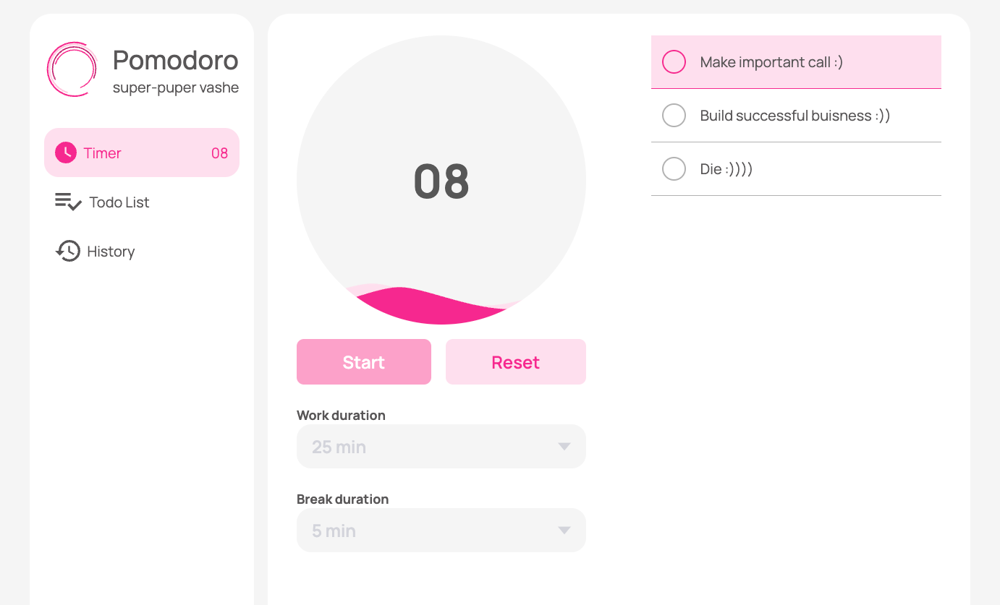

<h1 align="center">Welcome to pomodoro 👋</h1>
<p>
  <a href="https://www.npmjs.com/package/pomodoro" target="_blank">
    
  </a>
  
</p>



> This is pomodoro and todo list in one app. I build it to improve by productivity system. App is build in vue@^3 and uses firebase as hosting and database. Also google cloud quoes in use to reset the timer. UI is also design by me [figma](https://www.figma.com/file/E76rJWC0pDSKVtXYpjA79V/pomodoro?node-id=0%3A1&t=yDBhIfjj1AkKZw0l-1)

### 🏠 [Homepage](https://pomodoro.tokarev.work)

## Prerequisites

- node ^16

## Install
Make sure that java install on your machine

install firebase cli
```sh
npm i -g firebase-tools
```

init emulators
```shell
firebase init emulators
```

install dependencies

```sh
yarn install
```

## Usage

```sh
yarn start
```

## Author

👤 **Egor Tokarev**

* Website: https://tokarev.work
* Github: [@gregor-tokarev](https://github.com/gregor-tokarev)
